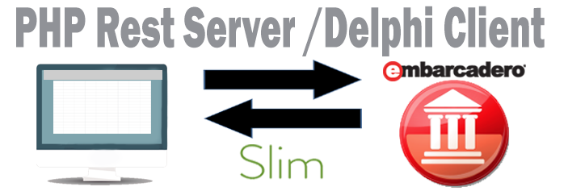

**PHP PDO REST SERVER**

**Part 1**

Creating a PHP REST Server using SLIM REST API Framework

This will cover the implementation of a REST Back-end for a Webserver. The PHP
SLIM framework library is lightweight and fast. Using this framework eliminates
the need to specially write your own which could easily face security issues.
Although REST provides the required connections, the developer will need to
write specific code for the Routes and Middleware to ensure that the dedicated
URL’s are setup correctly.

**Scope**

Set up a PHP REST Server and use a Debugger to test the Web Server.

**Setting Up**

-   It is best to use a [local XAMP](https://www.apachefriends.org/index.html)
    or [WAMP](https://sourceforge.net/projects/wampserver/) setup, an open
    source Apache Server. This will load
    [PHP](http://php.net/manual/en/intro-whatis.php),
    [MYSQL](https://www.mysql.com/downloads/) or [MARIA](https://mariadb.org/)
    database server depending on your Installation. Maria DB is an on-going Open
    Source alternative to MySQL DB and is designed by the same developers for
    MySQL DB. I am not going to explain how to set your Apache server for a
    quick Google on this subject will provide the required steps to set this up.

Composer is used to download [SLIM 3](https://www.slimframework.com/) into your
project. The SLIM 3 documentation explains how to perform this process.

[Bootstrap 3](http://getbootstrap.com/) is a Responsive mobile first framework
and is only used to View the database.

A live test REST Server example of the code is available so that calls can be
easily made from a REST DEBUGGER and ultimately from the various working DELPHI
CLIENT Applications that will be presented over the FIVE PART SERIES. This TEST
REST SERVER allows both HTTP and HTTPS Calls to be made to it.

**File Structure**

-   Folder dist:- holds the bootstrap 3 library for the view.php file.

-   Folder public :-contains the index.php to which all the url calls are made
    to.

-   .htaccess is an apache file.

-   The View.php:- shows a table view of the database. A button will call the
    Resetdb.php which in turn resets the Database. This is handy should all the
    data be deleted in your LocalHost Server.

-   Folder src:- contains the config folder for the db.php which connects to the
    MySql / Maria Database.

-   Folder routes:- has the pricing.php file which is file that will technically
    process all the REST Requests and Responses.

-   Folder vender:- is the Slim library.

**Database**

As this is a five part series Covering a pricelist REST server. The
salesREST.sql file has a single

pricelist table …

\`salesREST\`

Table structure for table \`pricelist\`

CREATE TABLE \`pricelist\` (

\`id\` int(11) NOT NULL,

\`sku\` varchar(20) DEFAULT NULL,

\`skusize\` varchar(20) DEFAULT NULL,

\`barcode\` varchar(25) DEFAULT NULL,

\`description\` varchar(100) DEFAULT NULL,

\`price\` float(30,2) DEFAULT NULL

) ENGINE=InnoDB DEFAULT CHARSET=latin1;

**Create the index.php**

To activate SLIM framework, we add the four lines below.

\<?php

use \\Psr\\Http\\Message\\ServerRequestInterface as Request;

use \\Psr\\Http\\Message\\ResponseInterface as Response;

require '../vendor/autoload.php';

\$app = new \\Slim\\App;

Instead of writing all the code to the index.php, all the call Requests are sent
to the routes folder where the pricing.php file receives each REST Request,
processes the Request and provides a REST Response. For a larger REST Server,
More routes would be introduced.

//Products and Pricing SRC Routes

require '../src/routes/pricing.php';

\$app-\>run();

?\>

**Adding the Database connection db.php**

This uses the PDO connection procedure and is wrapped in a class database.

To connect call \$pdo = Database::connect();

To Disconnect call Database::disconnect();

\<?php

class Database

{

private static \$dbName = 'salesREST' ;

private static \$dbHost = 'localhost' ;

private static \$dbUsername = 'root';

private static \$dbUserPassword = '';

private static \$conn = null;

public function \__construct() {

exit('Initialization is not allowed');

}

public static function connect()

{

// Use the same connection in all Forms

if ( null == self::\$conn )

{

try

{

self::\$conn = new PDO(
"mysql:host=".self::\$dbHost.";"."dbname=".self::\$dbName, self::\$dbUsername,
self::\$dbUserPassword);

}

catch(PDOException \$e)

{

die(\$e-\>getMessage());

}

}

return self::\$conn;

}

public static function disconnect()

{

self::\$conn = null;

}

}

?\>

**Create pricing.php**

-   This file will handle the GET, PUT, POST and DELETE calls.

Include the Database access in the config.

Include '../src/config/db.php';

-   First the call to use the REST Request interface and the REST Response
    interface of SLIM.

-   Then call the SLIM framework.

-   SLIM app told to use the folder routes and the function requirement is REST
    Request returning a REST Response (back to the client).

-   A middleware function is created by calling ‘\$app-\> add’ to accept
    authorization Headers (if required) and to accept the methods GET, POST, PUT
    and DELETE and OPTIONS. This invokes a PSR 7 Response ‘withHeader’.

use \\Psr\\Http\\Message\\ServerRequestInterface as Request;

use \\Psr\\Http\\Message\\ResponseInterface as Response;

\$app = new \\Slim\\App;

\$app-\>options('/{routes:.+}', function (\$request, \$response, \$args) {

return \$response;

});

\$app-\>add(function (\$req, \$res, \$next) {

\$response = \$next(\$req, \$res);

return \$response

\-\>withHeader('Access-Control-Allow-Origin', '\*')

\-\>withHeader('Access-Control-Allow-Headers', 'X-Requested-With, Content-Type,
Accept, Origin, Authorization')

\-\>withHeader('Access-Control-Allow-Methods', 'GET, POST, PUT, DELETE,
OPTIONS');

});

-   Call to SLIM to get the URL and the function to process the REST Request and
    return a REST Response.

-   The pricelist table is accessed and all data is fetched as a PDO object then
    encoded into JSON format, sent as the REST Request to the Client. If there
    is an error then the Error REST Response is sent.

//Get All Products and Prices

\$app-\>get('/api/pricing', function (Request \$request, Response \$response) {

\$sql = "SELECT \* FROM pricelist";

try{

\$pdo = Database::connect();

\$pdo-\>setAttribute(PDO::ATTR_ERRMODE, PDO::ERRMODE_EXCEPTION);

\$stmt = \$pdo-\>query(\$sql);

\$pricing = \$stmt-\>fetchAll(PDO::FETCH_OBJ);

Database::disconnect();

echo json_encode(\$pricing);

} catch(PDOException \$e){

echo '{"error": {"text": '.\$e-\>getMessage().'}';

}

});

-   The URL with {id} means that a row id number must be added to the URL.

-   The id is received by using the SLIM getattribute(‘id’) procedure.

-   The single row is fetched as a PDO OBJECT then encoded into JSON and sent as
    a REST Response.

//Get single Product Priced unit

\$app-\>get('/api/pricing/{id}', function (Request \$request, Response
\$response) {

\$id = \$request-\>getAttribute('id');

\$sql = "SELECT \* FROM pricelist where id = \$id";

try{

\$pdo = Database::connect();

\$pdo-\>setAttribute(PDO::ATTR_ERRMODE, PDO::ERRMODE_EXCEPTION);

\$stmt = \$pdo-\>query(\$sql);

\$pricing = \$stmt-\>fetchAll(PDO::FETCH_OBJ);

Database::disconnect();

echo JSON_encode(\$pricing);

>   } catch(PDOException \$e){

echo '{"error": {"text": '.\$e-\>getMessage().'}';

}

});

-   Adding product requires the getParam procedure to extract the JSON code
    directly.

-   Calling the INSERT sql will insert the record by using the prepare statement
    and bindparam to add the row items.

// Add Product and Pricing single field

\$app-\>post('/api/pricing/add', function(Request \$request, Response
\$response){

\$sku = \$request-\>getParam('sku');

\$skusize = \$request-\>getParam('skusize');

\$barcode = \$request-\>getParam('barcode');

\$description = \$request-\>getParam('description');

\$price = \$request-\>getParam('price');

\$sql = "INSERT INTO pricelist (sku,skusize,barcode,description,price)

values(:sku ,:skusize, :barcode, :description, :price)";

try{

\$pdo = Database::connect();

\$pdo-\>setAttribute(PDO::ATTR_ERRMODE, PDO::ERRMODE_EXCEPTION);

\$stmt = \$pdo-\>prepare(\$sql);

\$stmt-\>bindParam(':sku', \$sku);

\$stmt-\>bindParam(':skusize', \$skusize);

\$stmt-\>bindParam(':barcode', \$barcode);

\$stmt-\>bindParam(':description', \$description);

\$stmt-\>bindParam(':price', \$price);

\$stmt-\>execute();

Database::disconnect();

echo '{"notice": "Single Product and Pricing Added"}';

} catch(PDOException \$e){

echo '{"error": {"text": '.\$e-\>getMessage().'}';

}

});

-   Adding all the products requires a request using the getBody procedure.

-   The JSON decodes the object into an array.

-   Each row is looped using the foreach call and the row items are updated
    using the bindValue procedure.

// Add Product and Pricing many fields

\$app-\>post('/api/pricing/add/all', function(Request \$request, Response
\$response){

\$data = '['.\$request-\>getBody().']';

\$data=json_decode(\$data,true);

try{

//This is a slow method of update as each row is updated one at a time. Should
Update once only

\$pdo = Database::connect();

\$pdo-\>setAttribute(PDO::ATTR_ERRMODE, PDO::ERRMODE_EXCEPTION);

\$sql = "INSERT INTO pricelist (sku,skusize,barcode,description,price)

values(:sku ,:skusize, :barcode, :description, :price)";

\$stmt = \$pdo-\>prepare(\$sql);

foreach (\$data as \$data){

\$stmt-\>bindValue(':sku', \$data['sku']);

\$stmt-\>bindValue(':skusize', \$data['skusize']);

\$stmt-\>bindValue(':barcode', \$data['barcode']);

\$stmt-\>bindValue(':description',\$data['description']);

\$stmt-\>bindValue(':price', \$data['price']);

\$stmt-\>execute();

}

Database::disconnect();

echo '{"notice": "All Products and Pricing Added "}';

} catch(PDOException \$e){

echo '{"error": {"text": '.\$e-\>getMessage().'}';

}

});

-   Updating uses the id with get Attribute.

-   The getParam procedure converts the JSON into a PhP string variable.

-   The SQL call to UPDATE updates the row as per the id number.

// Update Pricing (Put)

\$app-\>put('/api/pricing/update/{id}', function(Request \$request, Response
\$response){

\$id = \$request-\>getAttribute('id');

\$sku = \$request-\>getParam('sku');

\$skusize = \$request-\>getParam('skusize');

\$barcode = \$request-\>getParam('barcode');

\$description = \$request-\>getParam('description');

\$price = \$request-\>getParam('price');

\$sql = "UPDATE pricelist SET

sku = :sku,

skusize = :skusize,

barcode = :barcode,

description= :description,

price = :price

WHERE id = \$id";

try{

// Get DB Object

\$pdo = Database::connect();

\$pdo-\>setAttribute(PDO::ATTR_ERRMODE, PDO::ERRMODE_EXCEPTION);

\$stmt = \$pdo-\>prepare(\$sql);

\$stmt-\>bindParam(':sku', \$sku);

\$stmt-\>bindParam(':skusize', \$skusize);

\$stmt-\>bindParam(':barcode', \$barcode);

\$stmt-\>bindParam(':description',\$description);

\$stmt-\>bindParam(':price', \$price);

\$stmt-\>execute();

Database::disconnect();

echo '{"notice": {"text": "Product and Price Updated"}';

} catch(PDOException \$e){

echo '{"error": {"text": '.\$e-\>getMessage().'}';

}

});

-   One URL is set for delete all and delete by id.

-   Delete all when id = ‘0’ and the table is truncated or cleared.

-   If the Id then a prepare statement is processed on the ID received with a
    client response.

// Delete price(product)

\$app-\>delete('/api/pricing/delete/{id}', function(Request \$request, Response
\$response){

\$id = \$request-\>getAttribute('id');

if (\$id==0){

\$sql = "TRUNCATE TABLE pricelist ";

}else{

\$sql = "DELETE FROM pricelist WHERE id = \$id";

}

try{

\$pdo = Database::connect();

\$pdo-\>setAttribute(PDO::ATTR_ERRMODE, PDO::ERRMODE_EXCEPTION);

\$stmt = \$pdo-\>prepare(\$sql);

\$stmt-\>execute();

Database::disconnect();

if (\$id==0){

echo '{"notice": "All Product and Prices Deleted"}';

}else{

echo '{"notice": "Product and Price Deleted"}';

}

} catch(PDOException \$e){

echo '{"error": {"text": '.\$e-\>getMessage().'}';

}

});

?\>

**.htaccess**

This needs to be placed in the index.php folder. It ia an Apache file that
rewrites the urls to be read correctly.

RewriteEngine On

RewriteCond %{REQUEST_FILENAME} !-f

RewriteCond %{REQUEST_FILENAME} !-d

RewriteRule \^ index.php [L]

**Testing and Debugging**

There are many free available Debuggers on the market. As the Five part series
covers a Delphi Client, I am making use of the free to [download Embarcadero
Debugger](https://www.embarcadero.com/free-tools/rest-debugger).

API Calls

The [‘Live View’ Sales REST
demo](http://www.bayeseanblog.com/blog/public/demo/salesrest/public/view.php)
accepts both http and https calls.

**API Calls -    id** *(integer) row no of the database table*

**Get All**
*'http://www.bayeseanblog.com/blog/public/demo/salesREST/public/api/pricing/'*

**Get One**
*'http://www.bayeseanblog.com/blog/public/demo/salesREST/public/api/pricing/id'*

**Put One**
*'http://www.bayeseanblog.com/blog/public/demo/salesREST/public/api/pricing/update/id'*

**Post**
*'http://www.bayeseanblog.com/blog/public/demo/salesREST/public/api/pricing/add'*

**Delete**
*'http://www.bayeseanblog.com/blog/public/demo/salesREST/public/api/pricing/delete/id'*

**Delete All**
*'http://www.bayeseanblog.com/blog/public/demo/salesREST/public/api/pricing/delete/0*

You can also send this request to your localhost. Be sure to have the index.php
live in the browser. It is correct not to show any data.

Change the first-part of the URL to your localhost URL and the debugger will
process the REST requests and responses on your local machine. Example:-

**Get All ‘***localhost/public/api/pricing/'*

**REST DEBUGGER using GET call**

**Get All**
*'http://www.bayeseanblog.com/blog/public/demo/salesREST/public/api/pricing/'*

The content type is set to application/JSON, add the ‘get URL ‘ and send the
request.

REST DEBUGGER using PUT call.

Set the Method to PUT and Add the URL as above.

Add to the Custom Body JSON code – an existing entry but changed

Example of the content

{

“id”:”3”,

“sku”: TAS013”,

“skusize”:”1x6”,

“barcode”:”6004567893”,

“description”:”Baby Food”,

“price”:”45.78”

}

Send Request…

**REST DEBUGGER using POST call**

Set the Method to POST and Add the URL as above.

Create JSON text as above and insert it in the custom body.

{

“id”:”55”,

“sku”: CRA013”,

“skusize”:”1x6”,

“barcode”:”6004567893”,

“description”:”Baby Food”,

“price”:”45.78”

}

Send Request…..

The Response will reply with a notice {Product and Pricing Added}

**REST DEBUGGER using DELETE call**

**To delete one record**

Change Method to Delete and Add the URL followed by the id to be deleted . Send
Request and the response will confirm That the Product and Price was deleted.

**To delete ALL records**

Change Method to Delete and Add the URL followed by ‘0’ . Send Request and the
response will confirm That ALL the Product and Price was deleted.

Feel free to download the Code and also make use of the Live REST debugger to
make calls to test how the REST SERVER functions when using your REST DEBUGGER.

**Live View**

View this [Live on the
Web-Server](http://www.bayeseanblog.com/blog/public/demo/salesrest/public/view.php).

**Website**

[www.Bayeseanblog.com](www.Bayeseanblog.com)**.**

Happy Coding
